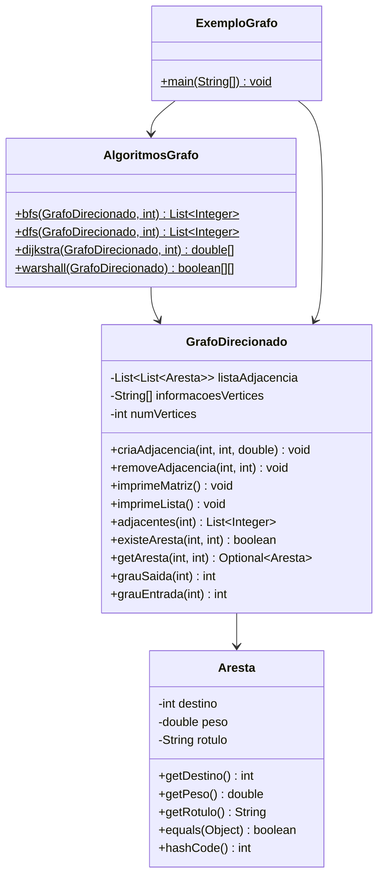
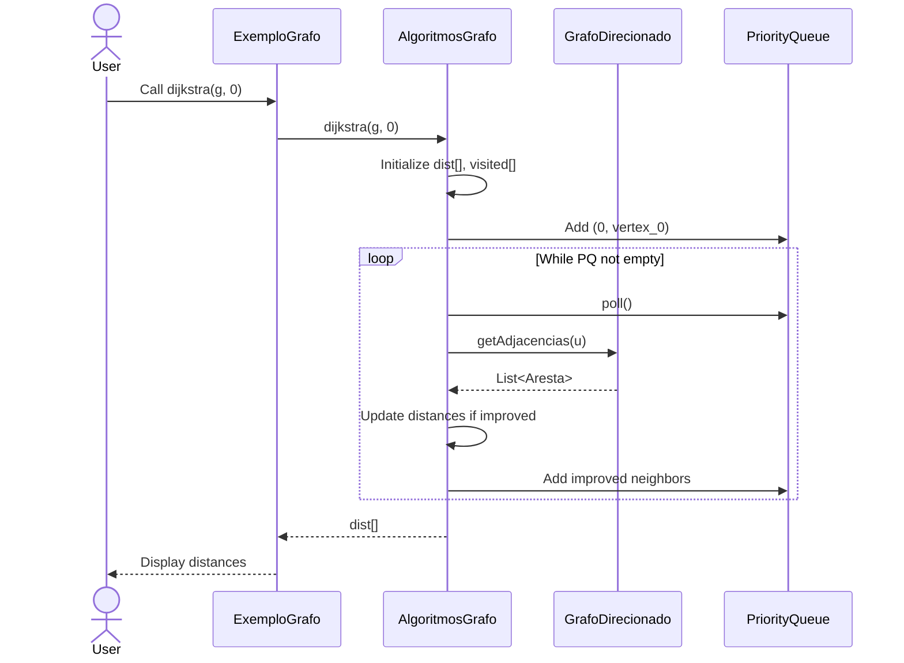

# Design

> Status: Active
> Authority: Tier 2 - Core Knowledge
> Last Updated: 2026-05-07
>
> **Aluno**: Jafte Carneiro Fagundes da Silva
> **Curso**: Ciência da Computação
> **Disciplina**: Resolução de Problemas com Grafos

## System Overview

**GraphTasksTDEs** is an educational Java project implementing a directed, weighted, and labeled graph with classic algorithms for traversal and analysis.

```
┌─────────────────────────────────────────┐
│         GraphTasksTDEs System            │
├─────────────────────────────────────────┤
│  Domain Layer                            │
│  ├── Aresta (Edge)                       │
│  ├── GrafoDirecionado (Graph)            │
├─────────────────────────────────────────┤
│  Algorithms Layer                        │
│  ├── AlgoritmosGrafo (Static utilities)  │
│  │   ├── bfs()                           │
│  │   ├── dfs()                           │
│  │   ├── dijkstra()                      │
│  │   └── warshall() [TDE 2]              │
├─────────────────────────────────────────┤
│  Application Layer                       │
│  ├── ExemploGrafo (Example/Test)         │
└─────────────────────────────────────────┘
```

## Domain Model

### Aresta (Edge)

```java
class Aresta {
    - int destino       // destination vertex
    - double peso       // weight
    - String rotulo     // optional label

    + getDestino()
    + getPeso()
    + getRotulo()
    + equals(Object): boolean
    + hashCode(): int
    + toString(): String
}
```

**Semantics**:
- Represents a directed edge in the graph
- Weight can represent cost, distance, or any numeric property
- Label is optional for documentation
- Two edges are equal if they share the same destination

### GrafoDirecionado (Directed Graph)

```java
class GrafoDirecionado {
    - List<List<Aresta>> listaAdjacencia  // adjacency list
    - String[] informacoesVertices         // vertex labels
    - int numVertices

    + criaAdjacencia(int i, int j, double peso)
    + criaAdjacencia(int i, int j, double peso, String rotulo)
    + removeAdjacencia(int i, int j)
    + imprimeMatriz()
    + imprimeLista()
    + imprimeAdjacencias()
    + setaInformacao(int i, String valor)
    + adjacentes(int i): List<Integer>
    + adjacentes(int i, int[] adj): int     // legacy
    + existeAresta(int i, int j): boolean
    + getAresta(int i, int j): Optional<Aresta>
    + grauSaida(int i): int
    + grauEntrada(int i): int
    + getAdjacencias(int i): List<Aresta>
    + getInformacao(int i): String
    + getNumVertices(): int
}
```

**Invariants**:
- Vertex indices: 0 ≤ i < numVertices
- No multi-edges (at most one edge from i to j)
- Self-loops allowed
- Cycles allowed

**Representation**: Adjacency list (space: O(V+E), time: good for sparse graphs)

### AlgoritmosGrafo (Algorithm Utilities)

Static utility class hosting graph algorithms:

```java
class AlgoritmosGrafo {
    + bfs(GrafoDirecionado g, int origem): List<Integer>
    + dfs(GrafoDirecionado g, int origem): List<Integer>
    + dijkstra(GrafoDirecionado g, int origem): double[]
    + warshall(GrafoDirecionado g): boolean[][]  // [TDE 2]
}
```

**Design Decision**: Static methods keep algorithms independent of graph state, enabling reuse and testing.

## Component Architecture



## Class Design

### Aresta

**Responsibility**: Model a directed edge with weight and optional label.

**Design Notes**:
- Immutable after creation (fields are private, no setters)
- `equals()` based on destination (edges with same destination are treated as equal)
- `hashCode()` consistent with `equals()`

### GrafoDirecionado

**Responsibility**: Model a directed, weighted, labeled graph.

**Design Notes**:
- Uses `List<List<Aresta>>` (no raw types)
- Validates vertex indices with `IllegalArgumentException`
- Separates concerns: matrix printing and list printing are separate methods
- Legacy `adjacentes(int, int[])` method preserved for compatibility
- New `adjacentes(int): List<Integer>` returns list instead of populating array

### AlgoritmosGrafo

**Responsibility**: Provide static implementations of classic graph algorithms.

**Design Pattern**: Utility class with static methods

**Algorithms**:
- **BFS**: Uses Queue, O(V+E) time
- **DFS**: Uses recursion, O(V+E) time
- **Dijkstra**: Uses PriorityQueue, O((V+E) log V) time, single-source shortest paths
- **Warshall**: O(V³) time, all-pairs reachability [TDE 2]

## Interfaces and Contracts

### Graph Contract

```java
// Any graph must support:
// - Creating edges with: criaAdjacencia(source, dest, weight)
// - Removing edges: removeAdjacencia(source, dest)
// - Querying adjacency: adjacentes(vertex): List<Integer>
// - Querying edges: getAresta(source, dest): Optional<Aresta>
// - Accessing vertex count: getNumVertices(): int
```

### Algorithm Contract

```java
// All algorithms expect:
// - Non-null graph
// - Valid vertex indices (0 ≤ vertex < graph.getNumVertices())
// - Throw IllegalArgumentException if preconditions violated
// - Return well-defined results (List, array, or matrix)
```

## Data Flow

### Graph Construction Flow

```
User → criaAdjacencia(i, j, peso) → Validate vertices →
Check for duplicates → Create Aresta(j, peso) →
Add to listaAdjacencia[i]
```

### Algorithm Execution Flow (example: BFS)

```
User → bfs(g, origem) → Initialize: visited[], queue →
Add origem to queue → While queue not empty:
  Dequeue v → Add to resultado →
  For each neighbor of v: if not visited, enqueue →
Return resultado
```

## Error Handling Strategy

**Validation Points**:
- Vertex index validation: throw `IllegalArgumentException`
- Duplicate edge: print warning, do not add
- Edge not found on removal: print warning, do not error
- Invalid input to algorithms: throw `IllegalArgumentException`

**Philosophy**: Fail fast on programming errors (wrong vertex), warn on data issues (duplicate edges).

## Security Considerations

- **Input Validation**: Vertex indices validated before use
- **No External Input**: Educational context, no user input from outside code
- **No Secrets**: No credentials or sensitive data in code
- **No Unsafe Operations**: No serialization, network access, or reflection

## Performance Considerations

| Operation | Complexity | Notes |
|-----------|-----------|-------|
| criaAdjacencia | O(k) | k = current degree of source vertex |
| removeAdjacencia | O(k) | Uses removeIf() |
| adjacentes | O(1) | Returns reference to edge list |
| BFS | O(V+E) | Queue-based |
| DFS | O(V+E) | Recursive |
| Dijkstra | O((V+E) log V) | PriorityQueue-based |
| Warshall | O(V³) | Three nested loops |

**Scalability**: Suitable for educational graphs (V < 1000). Larger graphs may require optimized data structures.

## UML Diagrams

### Class Diagram

(See above under Component Architecture section)

### Sequence Diagram: Dijkstra Execution



## Design Decisions

| Decision | Rationale | Alternatives Considered |
|----------|-----------|------------------------|
| Adjacency list | Space efficient for sparse graphs, good for iterating neighbors | Adjacency matrix (worse for sparse graphs) |
| Static algorithms | Keeps algorithms stateless and reusable | Instance methods (less reusable) |
| `IllegalArgumentException` | Standard for invalid arguments | Custom exceptions (overkill for homework) |
| `Optional<Aresta>` | Null-safe API | Returning null (not null-safe) |
| Separate print methods | Single responsibility, flexibility | One monolithic print method (less flexible) |

---

## Warshall Algorithm [TDE 2]

**Purpose**: Compute transitive closure (reachability matrix) for all vertex pairs.

**Input**: Directed graph G

**Output**: `boolean[V][V]` where `result[i][j] = true` iff there exists a path from i to j

**Algorithm**:
```
1. Initialize reachability[i][j] = true iff edge (i,j) exists
2. For k from 0 to V-1:
     For i from 0 to V-1:
       For j from 0 to V-1:
         reachability[i][j] = reachability[i][j] OR
                              (reachability[i][k] AND reachability[k][j])
3. Return reachability matrix
```

**Time Complexity**: O(V³)

**Space Complexity**: O(V²) for result matrix

**Status**: To be implemented in TDE 2
