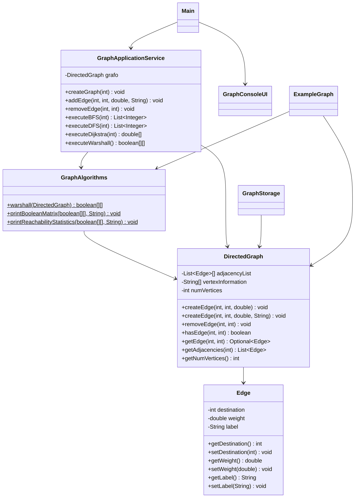

# Design

> Status: Active
> Authority: Tier 2 - Core Knowledge
> Last Updated: 2026-05-07
> Owner: Jafte Carneiro Fagundes da Silva

## Visao Geral

O GraphTasksTDEs e uma aplicacao Java de console para grafos direcionados, ponderados e rotulados. A arquitetura atual separa modelo, algoritmos, servico de aplicacao, interface de console, persistencia e pontos de entrada.

## Modelo De Dominio

### `Edge`

Representa uma aresta direcionada.

Campos principais:

- `destination`: vertice destino.
- `weight`: peso da aresta.
- `label`: rotulo opcional.

Observacao: a classe possui setters publicos, portanto nao deve ser documentada como imutavel.

### `DirectedGraph`

Representa o grafo direcionado.

Campos principais:

- `List<Edge>[] adjacencyList`
- `String[] vertexInformation`
- `int numVertices`

Contratos atuais:

- Vertices validos ficam no intervalo `0 <= vertex < numVertices`.
- A implementacao evita arestas duplicadas de uma mesma origem para o mesmo destino.
- `getAdjacencies(int)` retorna copia da lista de arestas do vertice.
- Metodos de compatibilidade em portugues ainda existem, mas a API preferida usa nomes em ingles.

## Componentes

| Componente | Responsabilidade |
| --- | --- |
| `br.edu.grafo.model` | `Edge` e `DirectedGraph`. |
| `br.edu.grafo.algorithm` | `GraphAlgorithms`, com Warshall e helpers de impressao. |
| `br.edu.grafo.application` | `GraphApplicationService`, com casos de uso, BFS, DFS e Dijkstra. |
| `br.edu.grafo.interfaces` | `GraphConsoleUI`, com entrada e saida de console. |
| `br.edu.grafo.util` | `GraphStorage`, com serializacao Java em `.bin`. |
| `br.edu.grafo.app` | `Main` e `ExampleGraph`. |

## Diagrama De Classes



## Fluxos Principais

### Criacao E Manipulacao

```text
User -> GraphConsoleUI -> GraphApplicationService -> DirectedGraph
```

### Warshall

```text
User -> Main/ExampleGraph -> GraphApplicationService ou GraphAlgorithms -> DirectedGraph
```

### Persistencia

```text
User -> GraphConsoleUI -> GraphApplicationService -> GraphStorage -> data/*.bin
```

## Tratamento De Erros

O contrato real e misto:

- `GraphApplicationService` lanca `IllegalArgumentException` para vertices invalidos em BFS, DFS e Dijkstra.
- `DirectedGraph` em varios metodos imprime mensagens de erro/aviso e retorna sem alterar estado.
- `GraphStorage` retorna `null` ou `false` em falhas de carga/salvamento e imprime mensagem no console.

Uma futura melhoria pode padronizar essa politica, mas isso alteraria comportamento e deve ser tratado em tarefa separada.

## Seguranca

- Nao ha credenciais no repositorio.
- A persistencia usa serializacao Java em arquivos `.bin`.
- Como `ObjectInputStream` e usado em `GraphStorage`, arquivos `.bin` devem ser tratados como entrada confiavel/local. Nao carregue arquivos binarios desconhecidos sem revisao.

## Performance

| Operacao | Complexidade |
| --- | --- |
| Adicionar/remover aresta | O(k), onde k e o grau de saida da origem |
| Consultar aresta | O(k) |
| BFS | O(V+E) |
| DFS | O(V+E) |
| Dijkstra | O((V+E) log V) |
| Warshall | O(V^3) |

## Status Dos Algoritmos

- BFS: implementado em `GraphApplicationService`.
- DFS: implementado em `GraphApplicationService`.
- Dijkstra: implementado em `GraphApplicationService`.
- Warshall: implementado em `GraphAlgorithms`.

## Verificacao Atual

A verificacao atual e manual:

```bash
java -cp output br.edu.grafo.app.ExampleGraph
```

Ainda nao ha testes automatizados. Isso deve ser registrado como gap, nao como funcionalidade existente.
