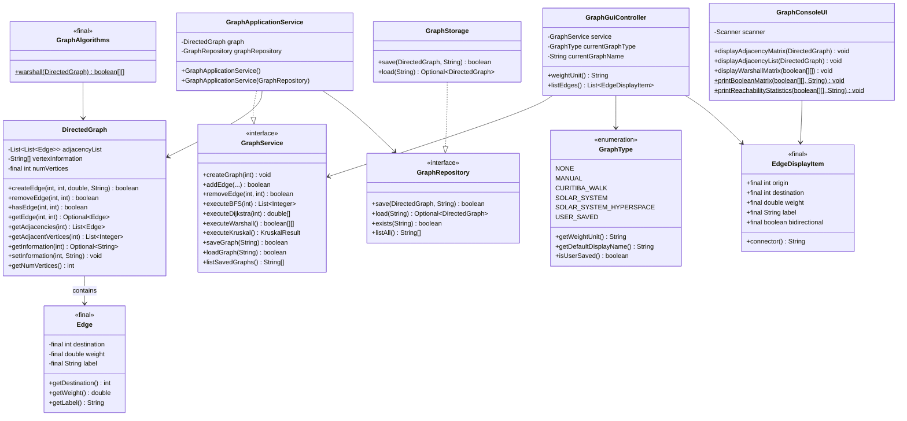
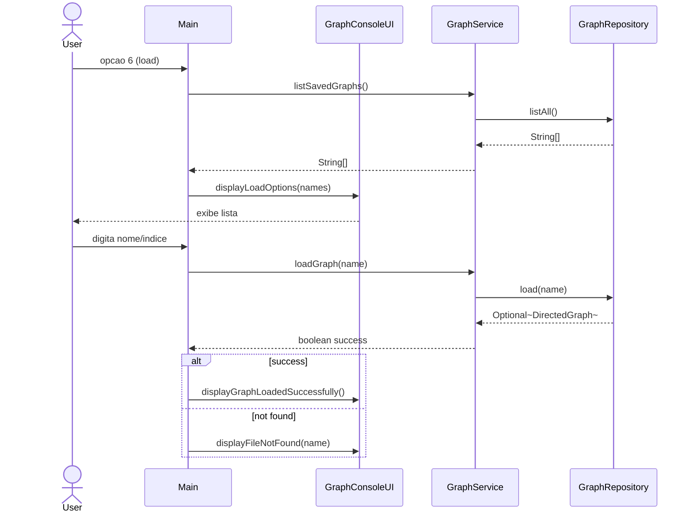
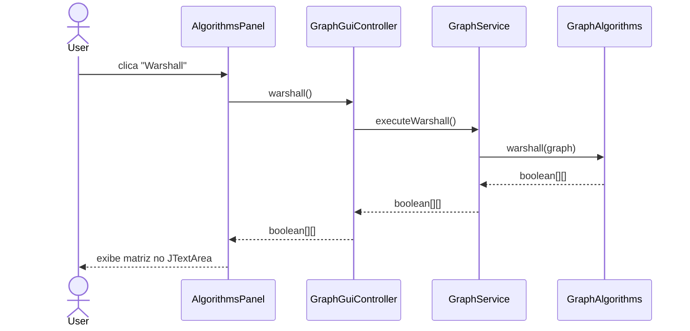

# Design

> Status: Active
> Authority: Tier 2 - Core Knowledge
> Last Updated: 2026-05-13
> Owner: Jafte Carneiro Fagundes da Silva

## System Overview

GraphTasksTDEs e uma aplicacao Java para grafos direcionados, ponderados e rotulados,
com interface de console e GUI Swing. A arquitetura segue uma separacao em camadas
(domain, application, infrastructure, interfaces, GUI, app) com dependencias unidirecionais
e inversao de dependencia via interfaces.

## Domain Model

### `Edge` (imutavel)

Representa uma aresta direcionada. Todos os campos sao `final`; nao ha setters.
Implementa `Serializable` para persistencia.

- `destination`: vertice destino (final)
- `weight`: peso da aresta (final)
- `label`: rotulo opcional, nunca null (final)

### `DirectedGraph`

Representa o grafo direcionado usando lista de adjacencia (`List<List<Edge>>`).

Contratos:
- Vertices validos: `0 <= vertex < numVertices`.
- Vertices invalidos lancam `IllegalArgumentException`.
- `createEdge` retorna `boolean` (false se aresta duplicada, sem excecao).
- `removeEdge` retorna `boolean` (false se aresta inexistente, sem excecao).
- `getInformation(int)` retorna `Optional<String>` (empty se nao definido).
- `getAdjacentVertices(int)` retorna `List<Integer>` imutavel.
- Sem metodos de I/O — e exclusivamente modelo de dominio (SRP).

## Component Architecture

| Pacote | Responsabilidade |
| --- | --- |
| `br.edu.grafo.model` | `Edge`, `DirectedGraph` — dominio puro, sem I/O |
| `br.edu.grafo.algorithm` | `GraphAlgorithms` (Warshall), `KruskalAlgorithm`, `KruskalResult` — algoritmos puros |
| `br.edu.grafo.application` | `GraphService` (interface), `GraphApplicationService`, `ShortestPathResult`, `EdgeDisplayItem`, `GraphType` |
| `br.edu.grafo.util` | `GraphRepository` (interface), `GraphStorage` — persistencia em `.bin` |
| `br.edu.grafo.interfaces` | `GraphConsoleUI` — apresentacao console |
| `br.edu.grafo.gui` | `GraphGuiController`, paineis Swing |
| `br.edu.grafo.app` | `Main`, `GraphDesktopApp`, exemplos |

## Interfaces and Contracts

### `GraphService` (`br.edu.grafo.application`)

Contrato para o servico de aplicacao. Implementado por `GraphApplicationService`.
Todos os clientes de alto nivel (`Main`, `GraphGuiController`) dependem desta interface (DIP).

Metodos principais:
- `createGraph(int)`, `setGraph(DirectedGraph)`, `getGraph()`, `hasGraph()`
- `addEdge(...) boolean`, `removeEdge(...) boolean`
- `executeBFS`, `executeDFS`, `executeDijkstra`, `executeShortestPath`, `executeWarshall`, `executeKruskal`
- `saveGraph(name) boolean`, `loadGraph(name) boolean`, `listSavedGraphs()`
- `findVertexByName`, `listVertexNames`, `findVertexNameSuggestions`

### `GraphRepository` (`br.edu.grafo.util`)

Contrato para persistencia. Implementado por `GraphStorage`.
Permite substituir implementacao sem alterar `GraphApplicationService` (DIP).

Metodos: `save(graph, name) boolean`, `load(name) Optional<DirectedGraph>`, `exists(name)`, `listAll()`

### `GraphType` (enum, `br.edu.grafo.application`)

Encapsula tipo de grafo com metadados (nome de exibicao, unidade de peso, flag de persistencia).
Elimina cadeia de `if` em `weightUnit()` (OCP).

Valores: `NONE`, `MANUAL`, `CURITIBA_WALK`, `SOLAR_SYSTEM`, `SOLAR_SYSTEM_HYPERSPACE`, `USER_SAVED`

### `EdgeDisplayItem` (value object, `br.edu.grafo.application`)

DTO imutavel compartilhado entre `GraphConsoleUI` e `GraphGuiController`.
Elimina duplicacao que existia em ambas as classes (DRY).

## Class Diagram



## Data Flow

### Console

```text
User -> Main -> GraphService -> DirectedGraph
             -> GraphConsoleUI (display)
```

### GUI

```text
User -> Swing Panel -> GraphGuiController -> GraphService -> DirectedGraph
```

### Persistencia

```text
GraphApplicationService -> GraphRepository -> GraphStorage -> data/*.bin
```

## Error Handling Strategy

Politica unificada apos refatoracao:

- `DirectedGraph`: vertices invalidos lancam `IllegalArgumentException`.
- `DirectedGraph.createEdge`: aresta duplicada retorna `false` (sem excecao).
- `DirectedGraph.removeEdge`: aresta inexistente retorna `false` (sem excecao).
- `GraphApplicationService`: vertices invalidos em BFS/DFS/Dijkstra lancam `IllegalArgumentException`.
- `GraphStorage`: falha de I/O retorna `false` / `Optional.empty()` (sem excecao).
- Nenhuma classe de dominio ou infraestrutura usa `System.out.println` para erros.

## Security Considerations

- Nenhuma credencial no repositorio.
- `ObjectInputStream` em `GraphStorage`: carregue apenas arquivos `.bin` locais e confiaveis.
- Nenhum dado externo e deserializado sem controle.

## Performance

| Operacao | Complexidade |
| --- | --- |
| Adicionar/remover aresta | O(k), k = grau de saida |
| Consultar aresta | O(k) |
| BFS / DFS | O(V + E) |
| Dijkstra | O((V + E) log V) |
| Warshall | O(V³) |
| Kruskal | O(E log E) |

## UML — Sequencia: Carregar Grafo (Console)



## UML — Sequencia: Executar Warshall (GUI)



## Design Decisions

| Decisao | Justificativa |
| --- | --- |
| `Edge` imutavel | Effective Java Item 17: value objects devem ser imutaveis para evitar efeitos colaterais |
| `GraphRepository` interface | DIP: `GraphApplicationService` nao depende de `GraphStorage` concreto |
| `GraphService` interface | DIP: `Main` e `GraphGuiController` dependem de abstracao, nao de implementacao |
| `GraphType` enum | OCP: novo tipo de grafo nao exige modificar `weightUnit()` |
| `EdgeDisplayItem` compartilhado | DRY: elimina duplicacao entre console e GUI |
| `Optional<String>` em `getInformation` | Explicit nullability: elimina retorno `null` |
| `boolean` return em `createEdge`/`removeEdge` | Tell, Don't Ask: operacoes comunicam resultado sem throw para casos esperados |
| Remocao de `printAdjacencies()` de `DirectedGraph` | SRP: modelo nao tem responsabilidade de apresentacao |
| Remocao de print em `GraphAlgorithms` | SRP: algoritmos nao tem responsabilidade de apresentacao |
| `List<List<Edge>>` em vez de `List<Edge>[]` | Elimina array generico e supressao de warning |

## Verification

```bash
# Compilar
powershell -Command "& 'C:\Program Files\JetBrains\CLion 2026.1\jbr\bin\javac.exe' -d output -sourcepath src (Get-ChildItem src -Recurse -Filter '*.java').FullName"

# Executar menu interativo
java -cp output br.edu.grafo.app.Main

# Executar exemplo
java -cp output br.edu.grafo.app.ExampleGraph

# Executar GUI
java -cp output br.edu.grafo.app.GraphDesktopApp
```

## Known Gaps

- Testes automatizados: nenhum ainda. JUnit 5 requer aprovacao para adicionar build tool (Maven/Gradle).
- `compile.sh` usa `--release 8` (obsoleto em JDKs modernos); pode ser atualizado para `--release 11` ou `--release 17`.
