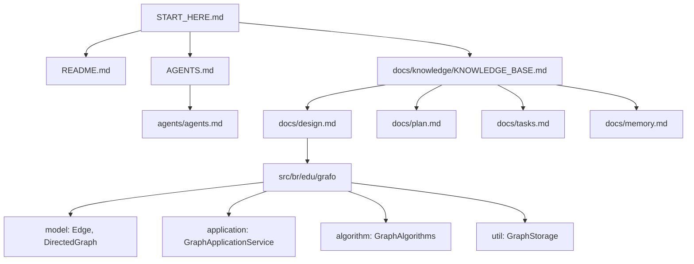

# Knowledge Base

> Status: Active
> Authority: Tier 2 - Core Knowledge Map
> Last Updated: 2026-05-07
> Owner: Jafte Carneiro Fagundes da Silva

## Purpose

Mapa de navegacao da documentacao e da arquitetura atual do projeto GraphTasksTDEs.

## Authority Hierarchy

### Tier 1: Source Of Truth

Local:

- `docs/knowledge/source-of-truth/`

Status atual:

- Nenhum documento Tier 1 foi criado.

### Tier 2: Core Knowledge

| Documento | Proposito |
| --- | --- |
| `AGENTS.md` | Ponte raiz para regras de agentes. |
| `agents/agents.md` | Regras completas de agentes. |
| `docs/design.md` | Arquitetura e contratos reais. |
| `docs/knowledge/core/00_project_context.md` | Contexto do projeto. |
| `docs/knowledge/core/01_domain_model.md` | Modelo de dominio. |
| `docs/knowledge/core/02_architecture.md` | Arquitetura tecnica. |

### Tier 3: Working Documents

| Documento | Proposito |
| --- | --- |
| `START_HERE.md` | Guia rapido de entrada. |
| `README.md` | Guia publico do projeto. |
| `docs/plan.md` | Plano concluido e gaps. |
| `docs/tasks.md` | Tarefas, status e checklist. |
| `docs/memory.md` | Decisoes e contexto duravel. |
| `docs/uml/` | Diagramas PlantUML. |

### Tier 4: Archive

Local:

- `docs/knowledge/archive/`

Status atual:

- Sem documentos arquivados relevantes.

## Concept Clusters

### Modelo De Grafo

- `Edge`: aresta direcionada com destino, peso e rotulo.
- `DirectedGraph`: grafo com lista de adjacencia.

Evidencia:

- `src/br/edu/grafo/model/Edge.java`
- `src/br/edu/grafo/model/DirectedGraph.java`

### Algoritmos

- BFS: `GraphApplicationService.executeBFS`.
- DFS: `GraphApplicationService.executeDFS`.
- Dijkstra: `GraphApplicationService.executeDijkstra`.
- Warshall: `GraphAlgorithms.warshall`.

Evidencia:

- `src/br/edu/grafo/application/GraphApplicationService.java`
- `src/br/edu/grafo/algorithm/GraphAlgorithms.java`

### Interface E Casos De Uso

- `Main`: menu interativo.
- `GraphConsoleUI`: entrada e saida do console.
- `GraphApplicationService`: orquestracao.
- `ExampleGraph`: exemplo manual.

### Persistencia

- `GraphStorage` salva, carrega e lista grafos `.bin`.
- A persistencia usa serializacao Java.

## Evidence Trails

### Por Que A Documentacao Pode Ficar Em Portugues?

O usuario aprovou explicitamente essa regra em 2026-05-07. A excecao esta registrada em:

- `AGENTS.md`
- `agents/agents.md`
- `docs/memory.md`

### Onde Ficam BFS, DFS E Dijkstra?

Eles ficam em `GraphApplicationService`, nao em `GraphAlgorithms`.

### Onde Fica Warshall?

Warshall fica em `GraphAlgorithms`.

### Existe Teste Automatizado?

Nao. A validacao atual e manual via `ExampleGraph`.

## Navigation Paths

### Para Entender O Projeto

1. `START_HERE.md`
2. `README.md`
3. `docs/design.md`
4. `docs/knowledge/core/00_project_context.md`
5. `docs/knowledge/core/01_domain_model.md`
6. `docs/knowledge/core/02_architecture.md`

### Para Mexer No Codigo

1. `AGENTS.md`
2. `agents/agents.md`
3. `docs/tasks.md`
4. `docs/design.md`
5. Arquivos em `src/br/edu/grafo`

### Para Validar Manualmente

1. Compilar com `javac` ou `./compile.sh`.
2. Executar `java -cp output br.edu.grafo.app.ExampleGraph`.
3. Conferir matriz de Warshall e mensagens do exemplo.

## Relationship Map

## Maintenance Rules

- Atualizar este arquivo quando houver novo modulo, nova decisao arquitetural ou novo documento relevante.
- Nao declarar como existentes testes, dependencias ou fluxos que nao estejam no repositorio.
- Nao usar nomes antigos em portugues para classes Java atuais.
- Registrar gaps conhecidos em vez de transforma-los em claims de completude.
