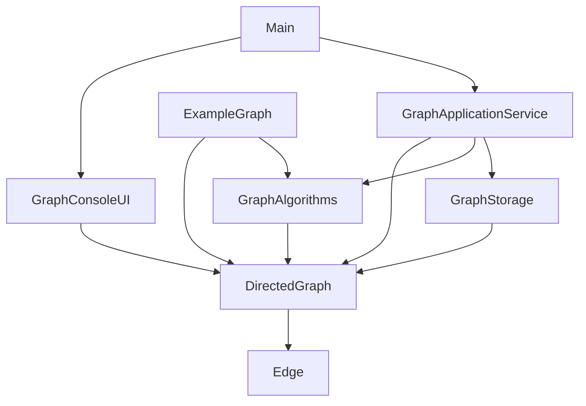

# Architecture

> Status: Active
> Authority: Tier 2 - Core Knowledge
> Last Updated: 2026-05-07
> Owner: Jafte Carneiro Fagundes da Silva

## Visao Geral

A arquitetura atual usa pacotes separados para modelo, algoritmos, servico de aplicacao, interface de console, persistencia e entradas executaveis.

## Estrutura De Pacotes

```text
src/br/edu/grafo/
├── model/
│   ├── Edge.java
│   └── DirectedGraph.java
├── algorithm/
│   └── GraphAlgorithms.java
├── application/
│   └── GraphApplicationService.java
├── interfaces/
│   └── GraphConsoleUI.java
├── util/
│   └── GraphStorage.java
└── app/
    ├── Main.java
    └── ExampleGraph.java
```

## Responsabilidades

| Pacote | Responsabilidade |
| --- | --- |
| `model` | Estado e estrutura do grafo. |
| `algorithm` | Algoritmos estaticos independentes do menu. |
| `application` | Casos de uso e orquestracao. |
| `interfaces` | Interacao de console. |
| `util` | Persistencia local. |
| `app` | Entradas executaveis. |

## Dependencias



## Camadas

### Modelo

- `Edge`
- `DirectedGraph`

### Algoritmos

- `GraphAlgorithms`

Contem:

- `warshall`
- `printBooleanMatrix`
- `printReachabilityStatistics`

### Aplicacao

- `GraphApplicationService`

Contem:

- BFS
- DFS
- Dijkstra
- Operacoes de criar grafo, adicionar/remover aresta, salvar/carregar e executar Warshall.

### Interface

- `GraphConsoleUI`

Centraliza prompts e exibicao.

### Persistencia

- `GraphStorage`

Usa `ObjectOutputStream` e `ObjectInputStream`.

## Fronteiras De Alteracao

- Mudancas em comportamento de grafo pertencem a `DirectedGraph`.
- Mudancas em BFS/DFS/Dijkstra pertencem a `GraphApplicationService`.
- Mudancas em Warshall pertencem a `GraphAlgorithms`.
- Mudancas de console pertencem a `GraphConsoleUI`.
- Mudancas de serializacao pertencem a `GraphStorage`.

## Gaps Conhecidos

- Nao ha testes automatizados.
- `output/` pode conter classes antigas e nao deve ser limpo sem confirmacao.
- A politica de erro nao e uniforme.
- `Edge` nao e imutavel.

## Related Documents

- `docs/design.md`
- `docs/knowledge/core/00_project_context.md`
- `docs/knowledge/core/01_domain_model.md`
